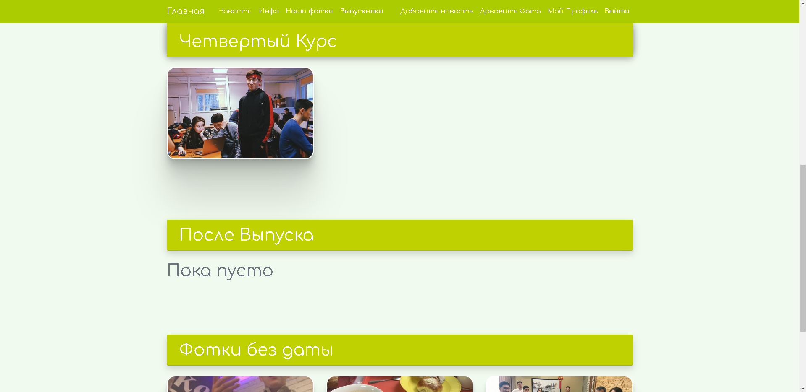

# Website for my groupmates in KazATU

### Main features:

  1.Blog post 
  2.Photo hosting with sorting based on date taken

### Screenshots of the website

<table>

  <tr>
    <td align="center">
       
      Landing page (Posts list)
    </td>
    <td align="center">
       
      Post view
    </td>
  </tr>

  <tr>
    <td align="center">
       
      Group view
    </td>
    <td align="center">
       
      Sections closed
    </td>
  </tr>

  <tr>
    <td align="center">
       
      Sections empty
    </td>
    <td align="center">
       
      Sections with photos
    </td>
  </tr>

  <tr>
    <td align="center">
       
      Photo hovered
    </td>
    <td align="center">
       
      Photos without metadata
    </td>
  </tr>

  <tr>
    <td align="center">
       
      Photo detailed view
    </td>
    <td align="center">
       
      Photo comments section
    </td>
  </tr>

</table>
